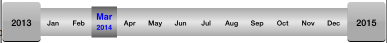
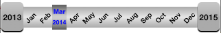
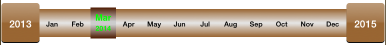

MonthSelector
=============

This component lets you to select month and year without days. It can be treated as month and year picker.

###Requirements
This component is compatible with ARC and iOS 6+.

###How to include in your project:
Create a single view based project. Add Quartzcore framework to your project. Simply add the `MonthSelector.h` and `MonthSelector.m` files in your project. 

###How to use:
Now in your ViewController.h file, add the MonthSelector Delegate like:

`@interface ViewController : UIViewController<MonthSelectorDelegate>` 

In ViewController.m file, create a object for MonthSelector. In `viewDidLoad` initialise the MonthSelector Object like:

`monthSelector = [[MonthSelector alloc] initWithVerticalPosition:100];`

where vertical position is the position where you want to place this component. 

Now add following lines:

`monthSelector.delegate = self;`
`[self.view addSubview:monthSelector];`

Now define the method for MonthSelectorDelegate 

`-(void)didSelectMonth:(NSInteger)month inYear:(NSInteger)year`

where you would receive the month and year as integer.

I have provided a method(`getMonthString:`) to get the month name in MMM format from integer, which can be used as :

`NSString *monthName = [monthSelector getMonthString:month];`

Now run the program. It will show the MonthSelector component on view.

###Usage
This component can be used for both ipad and iphone. On iPhone it looks as :

There are some common properties which can be changed to customise the component. eg You can change the theme and font sizes as in 

`monthSelector.monthFontsize =  [NSNumber numberWithInt:12];`

`monthSelector.yearFontsize = [NSNumber numberWithInt:14];`

`monthSelector.monthFontColor = [UIColor blackColor];`

`monthSelector.yearFontColor = [UIColor whiteColor];`

`monthSelector.highlightFontColor = [UIColor greenColor];`

`monthSelector.themeColor = [UIColor brownColor];`

###

###License

Usage of this component is provided under the [MIT License](http://opensource.org/licenses/mit-license.php).  See the `LICENSE` file for more info.
